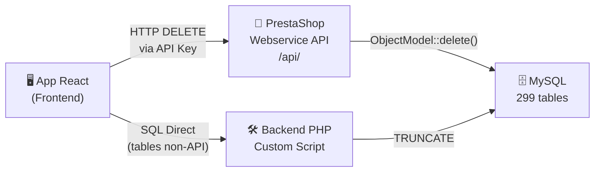

# 🔄 Analyse & Stratégie de Réinitialisation des Données PrestaShop

## 1. Résumé du Projet

| Élément | Détail |
|---|---|
| **Version** | PrestaShop 8.2.6 |
| **Architecture** | Hybride Legacy (`classes/`, `controllers/`) + Symfony (`src/`, `app/`) |
| **Base de données** | MariaDB, **299 tables**, préfixe `ps_` |
| **DB Name** | `prestashop` (user: `root`, host: `127.0.0.1`) |
| **API native** | Webservice REST (`/api/`) — XML/JSON, authentification par clé 32 chars |
| **Thème** | `classic` (Smarty pour Front-Office, Twig pour Back-Office) |

---

## 2. L'API Webservice PrestaShop — Ce qu'elle Expose

L'API Webservice expose **~70 ressources** (entités). Chaque ressource supporte potentiellement : `GET`, `POST`, `PUT`, `PATCH`, `DELETE`, `HEAD`.

### 2.1 Ressources supportant DELETE (via l'API)

| Ressource API | Classe PHP | Table(s) principale(s) |
|---|---|---|
| `products` | `Product` | `ps_product`, `ps_product_lang`, `ps_product_shop` |
| `categories` | `Category` | `ps_category`, `ps_category_lang`, `ps_category_shop` |
| `customers` | `Customer` | `ps_customer` |
| `orders` | `Order` | `ps_orders` |
| `order_details` | `OrderDetail` | `ps_order_detail` |
| `order_histories` | `OrderHistory` | `ps_order_history` |
| `order_invoices` | `OrderInvoice` | `ps_order_invoice` |
| `order_payments` | `OrderPayment` | `ps_order_payment` |
| `order_carriers` | `OrderCarrier` | `ps_order_carrier` |
| `order_cart_rules` | `OrderCartRule` | `ps_order_cart_rule` |
| `order_slip` | `OrderSlip` | `ps_order_slip` |
| `carts` | `Cart` | `ps_cart`, `ps_cart_product` |
| `cart_rules` | `CartRule` | `ps_cart_rule` |
| `addresses` | `Address` | `ps_address` |
| `combinations` | `Combination` | `ps_product_attribute` |
| `manufacturers` | `Manufacturer` | `ps_manufacturer` |
| `suppliers` | `Supplier` | `ps_supplier` |
| `carriers` | `Carrier` | `ps_carrier` |
| `contacts` | `Contact` | `ps_contact` |
| `groups` | `Group` | `ps_group` |
| `guests` | `Guest` | `ps_guest` |
| `messages` | `Message` | `ps_message` |
| `customer_threads` | `CustomerThread` | `ps_customer_thread` |
| `customer_messages` | `CustomerMessage` | `ps_customer_message` |
| `employees` | `Employee` | `ps_employee` |
| `tags` | `Tag` | `ps_tag` |
| `specific_prices` | `SpecificPrice` | `ps_specific_price` |
| `specific_price_rules` | `SpecificPriceRule` | `ps_specific_price_rule` |
| `images` | *(spécial)* | `ps_image` |
| `attachments` | `Attachment` | `ps_attachment` |
| `product_features` | `Feature` | `ps_feature` |
| `product_feature_values` | `FeatureValue` | `ps_feature_value` |
| `product_options` | `AttributeGroup` | `ps_attribute_group` |
| `product_option_values` | `ProductAttribute` | `ps_attribute` |
| `product_suppliers` | `ProductSupplier` | `ps_product_supplier` |
| `customizations` | `Customization` | `ps_customization` |
| `product_customization_fields` | `CustomizationField` | `ps_customization_field` |
| `deliveries` | `Delivery` | `ps_delivery` |
| `content_management_system` | `CMS` | `ps_cms` |
| `image_types` | `ImageType` | `ps_image_type` |
| `stores` | `Store` | `ps_store` |
| `tax_rules` | `TaxRule` | `ps_tax_rule` |
| `tax_rule_groups` | `TaxRulesGroup` | `ps_tax_rules_group` |
| `taxes` | `Tax` | `ps_tax` |

### 2.2 Ressources où DELETE est INTERDIT

| Ressource | Raison |
|---|---|
| `stock_movements` | Lecture seule (historique) |
| `stocks` | Lecture seule |
| `stock_availables` | Pas de POST/DELETE (géré automatiquement) |
| `warehouses` | DELETE interdit |
| `warehouse_product_locations` | Lecture seule |
| `supply_orders` / `supply_order_*` | Lecture seule |
| `search` | Lecture seule |
| `configurations` | ⚠️ DELETE techniquement possible mais **EXTRÊMEMENT DANGEREUX** |

---

## 3. Stratégie de Réinitialisation — Classification des 299 Tables

> [!IMPORTANT]
> On ne touche **JAMAIS** aux 299 tables. On cible uniquement les **données métier** (commandes, clients, paniers, produits).

### 🟢 TIER 1 — Tables à PURGER (données transactionnelles/opérationnelles)

Ce sont les données qui s'accumulent avec l'utilisation. **~60 tables**.

```
── COMMANDES & PAIEMENTS (~15 tables) ──
ps_orders                    ← Commandes
ps_order_detail              ← Détails commandes  
ps_order_detail_tax          ← Taxes par ligne
ps_order_history             ← Historique statuts
ps_order_carrier             ← Transporteurs par commande
ps_order_cart_rule           ← Promos appliquées
ps_order_invoice             ← Factures
ps_order_invoice_payment     ← Liens facture-paiement
ps_order_invoice_tax         ← Taxes factures
ps_order_payment             ← Paiements
ps_order_return              ← Retours
ps_order_return_detail       ← Détails retours
ps_order_slip                ← Avoirs
ps_order_slip_detail         ← Détails avoirs
ps_order_message             ← Messages commande (optionnel)

── PANIERS (~8 tables) ──
ps_cart                      ← Paniers
ps_cart_product              ← Produits dans paniers
ps_cart_cart_rule             ← Promos dans paniers

── CLIENTS (~8 tables) ──
ps_customer                  ← Clients (sauf id=0)
ps_customer_group            ← Associations clients-groupes
ps_customer_session          ← Sessions clients
ps_customer_thread           ← Fils SAV
ps_customer_message          ← Messages SAV
ps_customer_message_sync_imap
ps_address                   ← Adresses (type client)
ps_guest                     ← Visiteurs anonymes

── PRODUITS (~25 tables) ──
ps_product                   ← Produits
ps_product_lang              ← Traductions produits
ps_product_shop              ← Liaison produit-boutique
ps_product_attribute         ← Déclinaisons
ps_product_attribute_combination
ps_product_attribute_image
ps_product_attribute_lang
ps_product_attribute_shop
ps_product_carrier
ps_product_download
ps_product_sale
ps_product_supplier
ps_product_tag
ps_product_country_tax
ps_product_group_reduction_cache
ps_product_attachment
ps_product_comment           ← Avis (module)
ps_product_comment_criterion_product
ps_product_comment_grade
ps_product_comment_report
ps_product_comment_usefulness
ps_category_product          ← Liaison catégorie-produit
ps_feature_product           ← Caractéristiques produit
ps_pack                      ← Packs de produits
ps_accessory                 ← Accessoires
ps_image / ps_image_lang / ps_image_shop

── STATS & LOGS (~10 tables) ──
ps_connections / ps_connections_page / ps_connections_source
ps_page_viewed / ps_pagenotfound
ps_statssearch
ps_log
ps_search_index / ps_search_word
ps_ganalytics / ps_ganalytics_data
```

### 🟡 TIER 2 — Tables à CONSERVER (catalogue structurel / configuration métier)

Ces tables définissent la **structure** de la boutique. On les garde sauf demande contraire.

```
── CATÉGORIES ──
ps_category / ps_category_lang / ps_category_shop / ps_category_group

── ATTRIBUTS & CARACTÉRISTIQUES ──
ps_attribute / ps_attribute_lang / ps_attribute_shop
ps_attribute_group / ps_attribute_group_lang / ps_attribute_group_shop
ps_feature / ps_feature_lang / ps_feature_shop
ps_feature_value / ps_feature_value_lang

── TRANSPORTEURS ──
ps_carrier / ps_carrier_lang / ps_carrier_shop / ps_carrier_group
ps_carrier_zone / ps_carrier_tax_rules_group_shop

── PRIX SPÉCIAUX ──
ps_specific_price / ps_specific_price_rule / etc.
ps_cart_rule / ps_cart_rule_lang / etc.

── TAXES ──
ps_tax / ps_tax_lang / ps_tax_rule / ps_tax_rules_group / etc.

── FOURNISSEURS & FABRICANTS ──
ps_supplier / ps_manufacturer + _lang / _shop

── CMS ──
ps_cms / ps_cms_lang / ps_cms_category / etc.

── STOCK ──
ps_stock_available / ps_stock / ps_stock_mvt
ps_warehouse / etc.
```

### 🔴 TIER 3 — Tables INTOUCHABLES (système / infrastructure)

**Ne JAMAIS toucher ces tables**, sinon PrestaShop ne démarre plus.

```
ps_configuration / ps_configuration_lang / ps_configuration_kpi
ps_shop / ps_shop_group / ps_shop_url
ps_lang / ps_lang_shop
ps_country / ps_country_lang / ps_country_shop
ps_state / ps_currency / ps_currency_lang / ps_currency_shop
ps_zone / ps_zone_shop
ps_tab / ps_tab_lang
ps_employee / ps_employee_session / ps_employee_shop
ps_profile / ps_profile_lang
ps_access / ps_authorization_role
ps_hook / ps_hook_alias / ps_hook_module / ps_hook_module_exceptions
ps_module / ps_module_shop / ps_module_access / etc.
ps_webservice_account / ps_webservice_account_shop / ps_webservice_permission
ps_gender / ps_gender_lang
ps_group / ps_group_lang / ps_group_shop
ps_order_state / ps_order_state_lang
ps_order_return_state / ps_order_return_state_lang
ps_meta / ps_meta_lang
ps_risk / ps_risk_lang
ps_timezone / ps_operating_system / ps_web_browser
ps_smarty_cache / ps_smarty_last_flush / ps_smarty_lazy_cache
ps_translation
ps_image_type
ps_quick_access / ps_quick_access_lang
ps_date_range
ps_required_field
ps_import_match
ps_request_sql
ps_admin_filter
ps_memcached_servers
ps_api_access / ps_authorized_application
+ toutes les tables de modules système (ps_mbo_*, ps_eventbus_*, etc.)
```

---

## 4. Architecture Proposée — Application React de Réinitialisation

### 4.1 Vue d'ensemble



> [!WARNING]
> **L'API Webservice ne couvre que ~44 ressources sur ~60 tables à purger.** Pour le reste (stats, logs, tables de modules), il faudra un **script PHP backend complémentaire** qui exécute directement des `TRUNCATE TABLE` ou `DELETE FROM`.

### 4.2 Approche en 2 couches

#### Couche 1 : Via l'API Webservice (DELETE classique)
Pour les entités exposées : `products`, `orders`, `customers`, `carts`, `addresses`, etc.

```
Workflow par ressource :
1. GET /api/{resource}  → récupérer tous les IDs
2. DELETE /api/{resource}/?id=[id1,id2,id3,...]  → supprimer par lot
```

#### Couche 2 : Via un script PHP custom (tables non exposées)
Créer un fichier PHP dans PrestaShop (`/modules/datareset/api.php`) pour les tables comme :
- `ps_connections`, `ps_log`, `ps_search_index`, `ps_page_viewed`, etc.
- Tables de modules (ps_ganalytics, ps_pscheckout_*, ps_wishlist_*, etc.)

### 4.3 Ordre de suppression (respect des FK)

> [!CAUTION]
> Les clés étrangères imposent un **ordre de suppression précis**. Supprimer un `customer` avant ses `orders` cassera tout.

```
Ordre recommandé :
1. ps_order_detail_tax → ps_order_detail → ps_order_invoice_payment
   → ps_order_invoice_tax → ps_order_invoice
2. ps_order_cart_rule → ps_order_carrier → ps_order_history
   → ps_order_payment → ps_order_return_detail → ps_order_return
   → ps_order_slip_detail → ps_order_slip
3. ps_orders
4. ps_cart_cart_rule → ps_cart_product → ps_cart
5. ps_customer_message → ps_customer_thread → ps_customer_session
   → ps_customer_group → ps_address (type client)
6. ps_customer
7. ps_product_attribute_* → ps_product_* → ps_image_* → ps_product
8. ps_guest → ps_connections_* → ps_log → ps_search_*
```

---

## 5. Décision Clé — Quelles Tables Réinitialiser ?

### Option A : Reset "Données clients/commandes uniquement" *(recommandé pour un env. de test)*
- Purger : Commandes, Paniers, Clients, Adresses, SAV, Logs/Stats
- Garder : Produits, Catégories, Transporteurs, Taxes, Config

### Option B : Reset "Tout sauf le système" *(remise à zéro complète)*
- Purger : Tout le TIER 1 + les produits/catégories du TIER 2
- Garder : Uniquement le TIER 3 (système)

### Option C : Reset "Complet via réinstallation"
- Supprimer la DB et relancer l'installeur PrestaShop
- Le plus propre mais perd toute configuration

---

## 6. Prochaines Étapes

1. **Choisir l'option (A, B, ou C)** → me le confirmer
2. **Créer la clé API Webservice** dans le Back-Office (si pas déjà fait) avec permissions DELETE sur toutes les ressources ciblées
3. **Créer le module PHP backend** (`datareset`) pour les tables non couvertes par l'API
4. **Créer l'app React** avec interface de sélection des catégories de données à purger et confirmation de sécurité

> [!NOTE]
> Si vous choisissez l'option A ou B, je peux immédiatement commencer à coder l'application React + le module PHP backend. Dites-moi quelle option vous convient.
