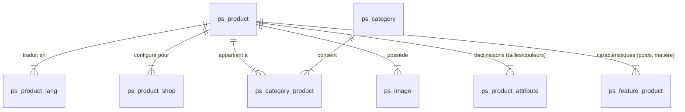
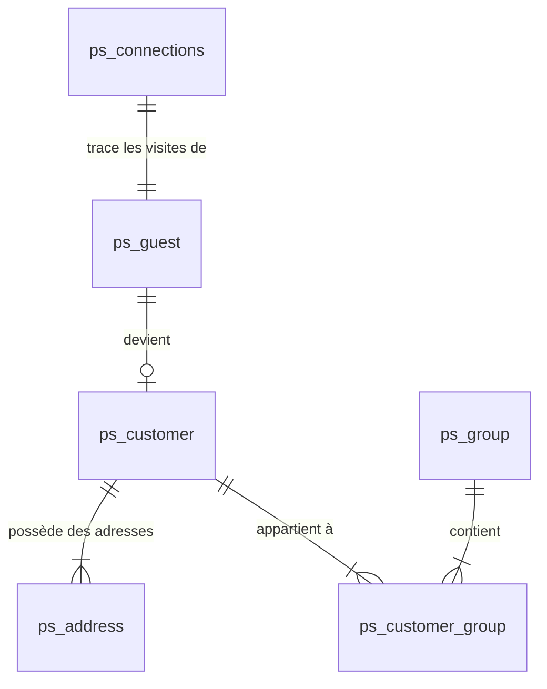
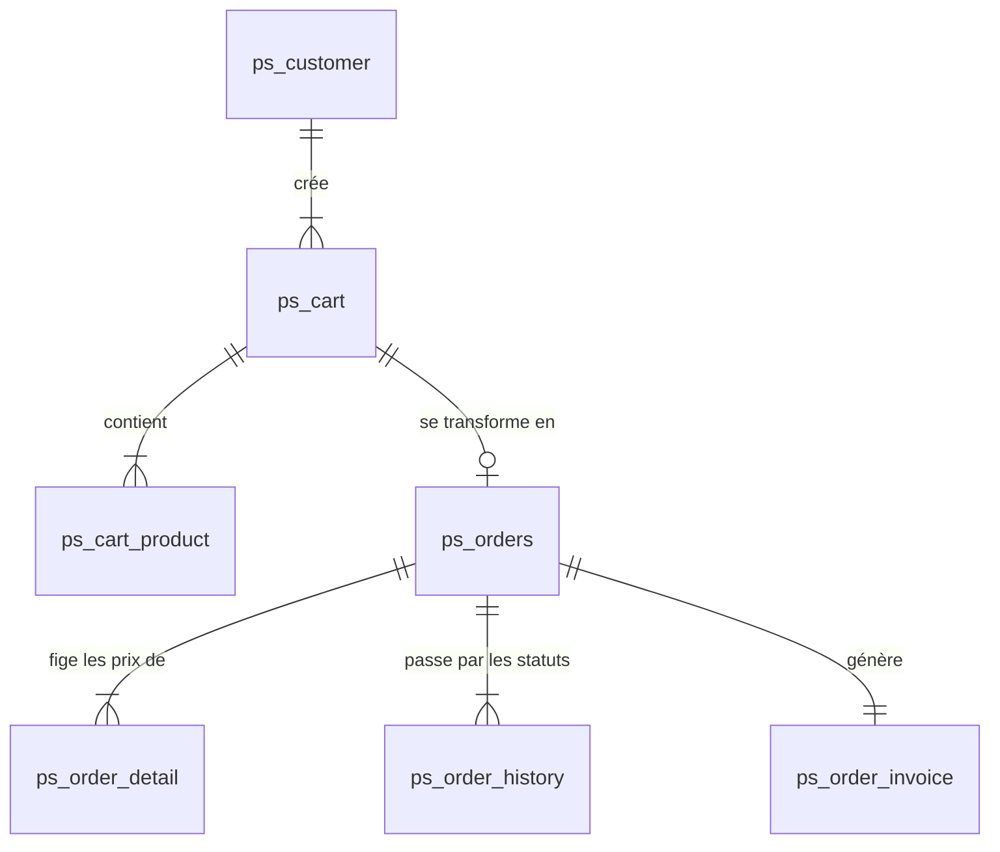
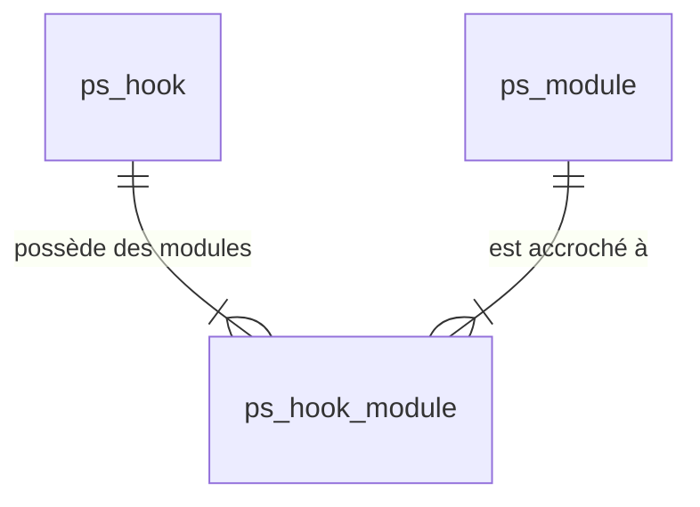

# Architecture et Schéma Relationnel de la Base de Données PrestaShop

Une installation classique de PrestaShop contient en effet près de **300 tables**. Cela s'explique par sa conception hautement modulaire, sa gestion native du multilinguisme (suffixes `_lang`) et du multiboutique (suffixes `_shop`).

Ce document explique les relations (clés étrangères logiques) et le fonctionnement des pôles majeurs de la base de données.

---

## 1. La Logique Globale (Pourquoi tant de tables ?)
Pour éviter d'avoir des tables géantes avec des centaines de colonnes vides, PrestaShop normalise à l'extrême. Pour une entité comme un Produit, les données sont divisées :
* **La table principale** (`ps_product`) : Les données universelles (ex: prix, poids, référence).
* **La table de traduction** (`ps_product_lang`) : Les textes (nom, description) pour chaque langue (`id_lang`).
* **La table de boutique** (`ps_product_shop`) : Les spécificités par boutique (`id_shop`) comme la TVA ou si le produit est actif dans la boutique A mais pas B.

---

## 2. Le Pôle "CATALOGUE" (Produits & Catégories)

C'est le cœur du système. Un produit n'est jamais isolé ; il est lié à des catégories, des images, des déclinaisons (tailles/couleurs) et des caractéristiques.

### Explications des liaisons "Produit"
* **`ps_product`** : La table maîtresse. Sa clé primaire est `id_product`.
* **`ps_category` & `ps_category_product`** : Un produit peut être dans plusieurs catégories (ex: "T-Shirts" et "Promotions"). La table `ps_category_product` fait le lien `id_product` <-> `id_category`. La table `ps_product` a aussi un champ `id_category_default` (pour l'URL et le fil d'ariane).
* **`ps_product_attribute` (Les Déclinaisons)** : Si votre produit existe en S, M, L, chaque taille aura une ligne dans cette table avec son propre stock (`quantity`) et un impact sur le prix final. Ces lignes sont liées au produit via `id_product`.
* **`ps_feature_product` (Les Caractéristiques)** : Les fiches techniques (ex: Matière: Coton). Lie `id_product` à `id_feature` et `id_feature_value`.
* **Les modules concernés** : Le module `ps_facetedsearch` (navigation à facettes) scanne constamment ces tables (attributs, caractéristiques, catégories) pour remplir sa propre table d'indexation (`ps_layered_category`) et permettre aux clients de filtrer les produits rapidement.

---

## 3. Le Pôle "CRM" (Clients & Adresses)

### Explications des liaisons "Client"
* **`ps_customer`** : Contient l'email, le mot de passe, le nom et le prénom. Clé primaire : `id_customer`.
* **`ps_address`** : Séparée du client ! Pourquoi ? Parce qu'un client peut avoir une adresse de livraison (Bureau) et une adresse de facturation (Maison). Elle est liée par `id_customer`.
* **`ps_group` & `ps_customer_group`** : Un client peut être un "Visiteur", un "Invité", ou un "Client Pro". Les groupes permettent d'appliquer des réductions globales.
* **`ps_guest` & `ps_connections`** : Dès qu'un internaute arrive sur le site (même non connecté), PrestaShop lui assigne un `id_guest` dans ses cookies et enregistre ses visites dans `ps_connections`. Quand il crée un compte, `ps_guest` est lié à `id_customer`.
* **Les modules concernés** : Les modules comme `ps_emailsubscription` (Newsletter) se lient aux clients. Les modules statistiques (ex: `statsbestcustomers`) lisent la table `ps_customer` en jointure avec `ps_orders` pour calculer la "valeur" d'un client.

---

## 4. Le Pôle "VENTES" (Paniers & Commandes)

Le cycle de vente est divisé en deux mondes étanches : "Avant Paiement" (Panier) et "Après Paiement" (Commande). C'est crucial d'un point de vue légal et comptable.

### Explications des liaisons "Commande"
* **`ps_cart` (Panier)** : Lié au client (`id_customer`) ou au visiteur (`id_guest`). Il stocke aussi le transporteur choisi (`id_carrier`) et l'adresse choisie (`id_address_delivery`).
* **`ps_cart_product`** : Lie le panier (`id_cart`) au produit (`id_product`) et à sa déclinaison exacte (`id_product_attribute`), avec la quantité.
* **`ps_orders` (La Commande)** : Au moment où le paiement est validé (par carte, paypal, etc.), une ligne est créée. Elle "copie" le panier (`id_cart` est conservé comme lien de traçabilité).
* **`ps_order_detail`** : L'historique légal. Elle copie le nom textuel du produit, son prix exact à la seconde de l'achat, et les taxes. **Pourquoi ?** Parce que si vous modifiez le nom ou le prix du produit dans `ps_product` un mois plus tard, la facture passée du client (`ps_order_detail`) ne doit surtout pas changer !
* **`ps_order_history`** : Suit la vie de la commande. Lié par `id_order` et `id_order_state` (En attente, Payé, Expédié).
* **Les modules concernés** :
  - **Modules de Paiement** (`ps_checkout`, `ps_wirepayment`) : Interviennent pour transformer le statut du panier et créer l'entrée dans `ps_orders`.
  - **Modules d'expédition** (`psshipping`) : Lisent le panier pour calculer le coût, puis mettent à jour `ps_order_carrier` (qui stocke le numéro de suivi du colis).

---

## 5. Le Pôle "SYSTÈME & MODULES" (Comment les modules s'intègrent)

Comment un module agit-il sur une commande ou affiche-t-il un bloc sur la page produit ?

* **`ps_hook`** : La liste des points d'ancrage (ex: `id_hook = 10`, nom = `displayHome`).
* **`ps_module`** : La liste des modules installés (ex: `id_module = 25`, nom = `ps_shoppingcart`).
* **`ps_hook_module`** : La table d'intersection ! Elle dit "Le module 25 doit s'exécuter sur le hook 10, à la position 1 (tout en haut)".

### Quand un module crée ses propres tables
Les 299 tables incluent aussi des dizaines de tables créées par les modules pour leurs propres besoins. Elles sont généralement supprimées si le module est désinstallé.
* Exemple 1 : Le module `blockwishlist` (Liste de souhaits) crée les tables `ps_wishlist` et `ps_wishlist_product` liées à `ps_customer` et `ps_product`.
* Exemple 2 : Le module `ps_emailalerts` crée `ps_mailalert_customer_oos` qui lie un `id_product` à un email client pour le prévenir d'un retour en stock.

## Résumé du parcours de la donnée
Lorsqu'un **Client** (`ps_customer`) visite une page **Catégorie** (`ps_category`), le module de **Filtre** (`ps_facetedsearch`) lit les attributs des **Produits** (`ps_product_attribute`) pour afficher le catalogue. Le client ajoute un article, ce qui remplit son **Panier** (`ps_cart`). Au moment de payer, le **Module de Paiement** (ex: `ps_checkout`) valide la transaction et transforme le panier en **Commande** (`ps_orders`). Les prix sont figés (`ps_order_detail`), le statut mis à jour (`ps_order_history`), et la facture comptable générée (`ps_order_invoice`).
